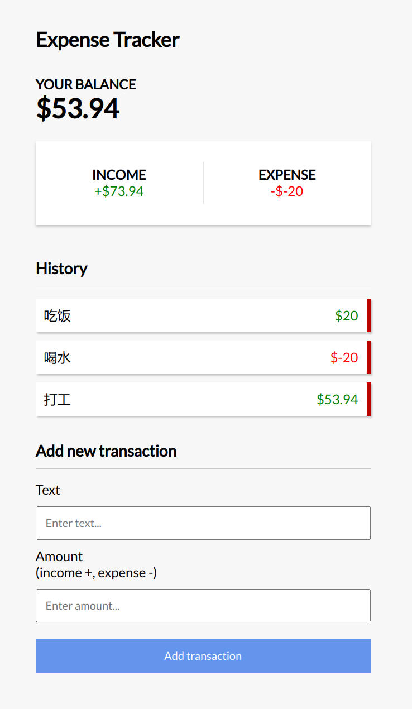

# expenseTracker
一个练手的小项目
<a href="https://github.com/bradtraversy/vue-expense-tracker">这里是原项目仓库</a>，此项目是在观看视频之后自己使用react+next复刻出来的


### 项目配置
```
安装依赖
npm i
本地调试
npm run dev
react打包
npm run build
```
